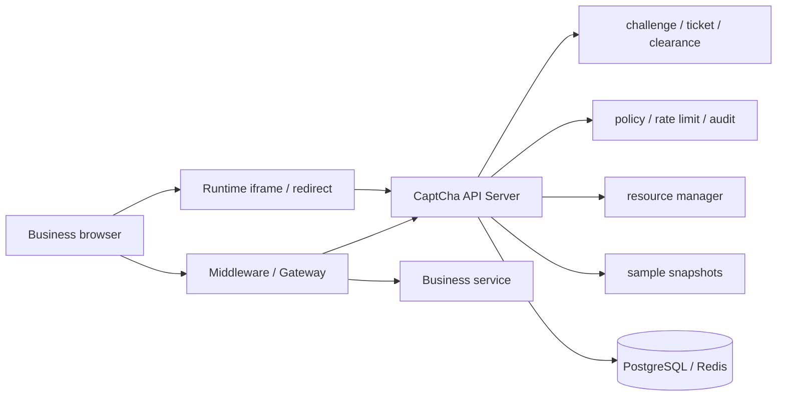

# Architecture Overview

CaptCha is a backend-verified human verification platform. The browser renders challenges and reports interaction facts; the platform owns answers, scoring rules, tickets, clearance, rate limits, audit, and risk decisions.

## Components



## Runtime

The runtime is embedded by business pages through iframe or redirect mode. It receives public challenge rendering data, collects interaction facts, and returns a one-time ticket after verification.

Runtime code must not receive answers, scoring thresholds, client secrets, admin tokens, gRPC tokens, or production policy internals.

## Middleware And Gateway

Middleware packages are used when the business service can add a request-chain layer. They check tickets, set or read clearance, call the CaptCha API server, and either continue to the protected handler or return a challenge response.

Gateway mode is used when the business service should stay unchanged. The gateway sits in front of the upstream service and performs the same ticket, clearance, and policy checks at the edge.

## API Server

The API server is the source of truth for:

- Challenge generation and verification.
- One-time ticket issuing and consumption.
- Clearance issuing, validation, and TTL.
- Route policy, rate limits, and risk decisions.
- Resource materials and sanitized runtime payloads.
- Audit events and behavior sample snapshots.

## HTTP And gRPC APIs

HTTP and gRPC are low-level integration surfaces. Use them to build custom gateways, service mesh adapters, internal control planes, or platform-specific middleware.

Public browser code should use only runtime-safe endpoints. Data-plane and admin operations require trusted backend callers and configured secrets.

## Storage

Local development can run with in-memory storage and demo data. Production deployments should use PostgreSQL for durable state and Redis for short-lived ticket, clearance, rate-limit, and runtime counters.

## Deployment Boundary

Production deployments should set:

```bash
CAPTCHA_ENV=production
```

or:

```bash
CAPTCHA_PRODUCTION=true
```

Production mode requires admin, gRPC, metrics, and collector tokens, explicit browser origins, explicit return URL origins, PostgreSQL, Redis, and disabled demo seeding. It also rejects Policy, Ticket, Config, and Event access for legacy applications without a client secret.

The admin UI generates an application secret on creation and displays it once. It keeps the admin token only in the current tab's `sessionStorage`; the token cannot be injected through a frontend build variable. The production HTML CSP limits network requests to the API origin configured at build time.

The Gateway trusts account, device, and risk/model context headers only when the direct source matches `CAPTCHA_TRUSTED_PROXY_CIDRS` and `CAPTCHA_TRUSTED_CONTEXT_TOKEN` is valid. Failed checks remove the context headers, and the context token is never forwarded upstream.

The collector accepts its token only through a dedicated header or Bearer authentication. `CAPTCHA_SERVER_TRUSTED_PROXY_CIDRS` enables nearest-untrusted-hop client IP resolution for per-application collection rate limits.

Admin hosting must emit clickjacking protection as HTTP response headers. Vite dev/preview does this automatically; production Nginx deployments can use `deploy/nginx/captcha-admin.conf.example`.

## Related Documents

- [Integration Guide](integration-guide.md)
- [HTTP / gRPC API](api-reference.md)
