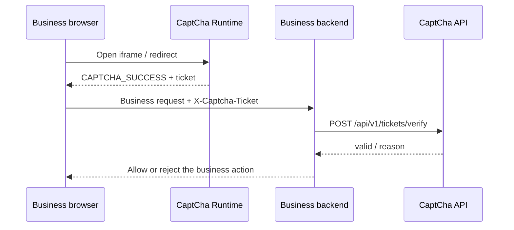

# Backend Ticket Verification

Language: [中文](../zh/backend-ticket-verification.md) | English

Use this path when you can change both the page and the business backend. The browser only receives a one-time `ticket`; the business backend consumes it before completing login, registration, payment, or another protected action.

## Request Flow



## Pass The Ticket From The Page

```html
<iframe
  src="https://captcha.example.com/?client_id=demo&scene=login&captcha_type=AUTO&route=/api/login&request_nonce=nonce-123"
  width="360"
  height="420"
  title="CaptCha"
></iframe>

<script>
  window.addEventListener("message", (event) => {
    if (event.origin !== "https://captcha.example.com") return;
    if (event.data?.type !== "CAPTCHA_SUCCESS") return;

    fetch("/api/login", {
      method: "POST",
      headers: {
        "content-type": "application/json",
        "x-captcha-ticket": event.data.ticket,
        "x-captcha-request-nonce": "nonce-123"
      },
      body: JSON.stringify({ username: "alice", password: "secret" })
    });
  });
</script>
```

## Consume The Ticket On The Backend

Keep `client_secret` on the backend only. `consume: true` makes the ticket single-use, so repeated submissions should fail.

```ts
app.post("/api/login", async (req, res) => {
  const result = await fetch("https://captcha.example.com/api/v1/tickets/verify", {
    method: "POST",
    headers: {
      "content-type": "application/json",
      "x-captcha-client-secret": process.env.CAPTCHA_CLIENT_SECRET || ""
    },
    body: JSON.stringify({
      client_id: "demo",
      scene: "login",
      ticket: req.get("x-captcha-ticket") || "",
      route: "/api/login",
      request_nonce: req.get("x-captcha-request-nonce") || "",
      consume: true
    })
  }).then((response) => response.json());

  if (!result.valid) {
    return res.status(403).json({ error: result.reason || "CAPTCHA_FAILED" });
  }

  return res.json({ ok: true });
});
```

## Bound Context

- `route` and `request_nonce` bind the ticket to one business action.
- If there is no user `uid`, do not invent an account identifier.
- When an account or anonymous device identifier exists, send `account_id_hash` / `device_id_hash` from the backend and do not send raw user IDs.
- If the ticket was created by middleware, Gateway, or the policy API, consumption must also match the bound IP/User-Agent hashes and optional account/device hashes.

## Clearance

The minimal iframe path can consume tickets without handling clearance.

If you want fewer repeated challenges on follow-up requests, prefer middleware or Gateway. They handle `captcha_clearance`, IP/UA binding, policy evaluation, and failure reporting automatically.

## Next

- [Quickstart](quickstart.md)
- [Middleware Integration](middleware-integration.md)
- [HTTP / gRPC API](api-reference.md)
