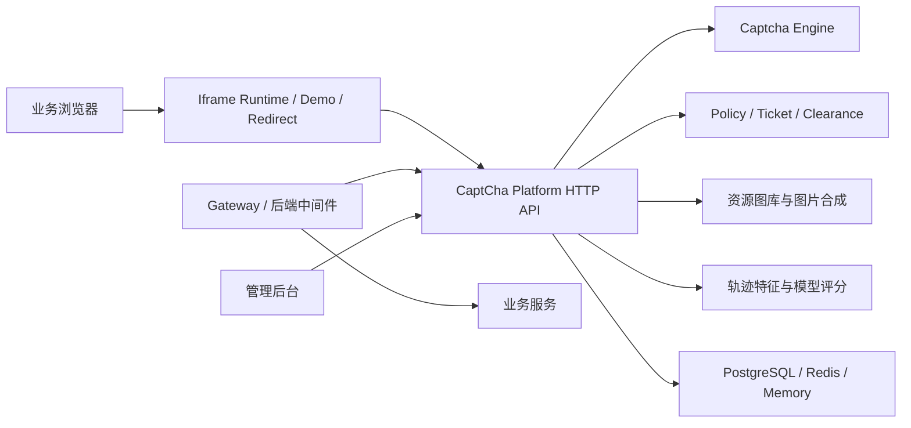
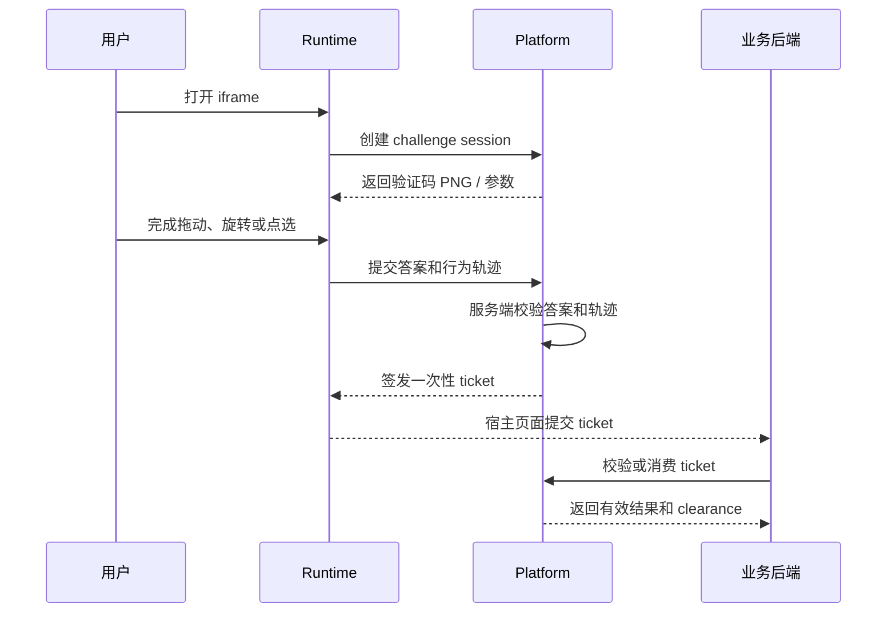
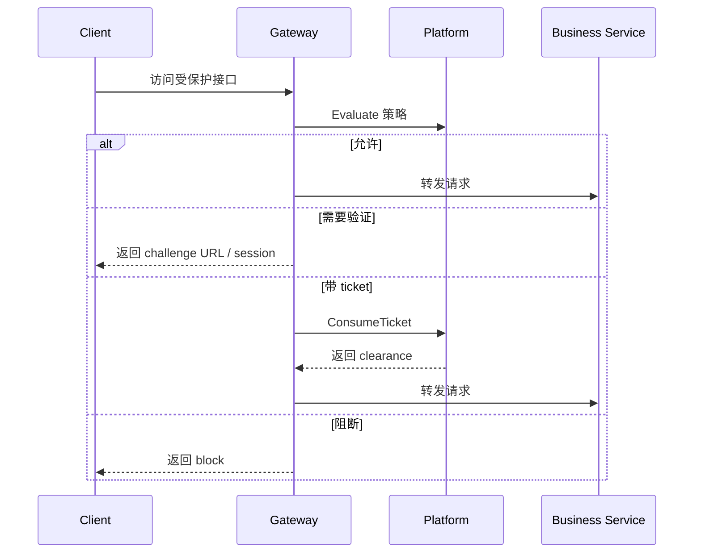

# CaptCha 项目评审简报

本文用于给外部或团队评审人员快速了解当前项目。完整设计细节仍以 `docs/architecture-design.md` 为准，本文只保留项目定位、内部功能、核心实现思路、当前状态和评审关注点。

## 1. 项目定位

CaptCha 是一个开源人机验证平台，不是传统验证码 SDK。

项目目标是把验证码挑战、策略判断、一次性 ticket、Gateway / 中间件接入、资源图库、审计和轨迹风险分析组合成一套可独立部署的验证平台。验证码本身只是挑战动作，平台真正要解决的是“哪些请求需要验证、使用什么强度验证、验证后如何安全放行、后续请求如何避免重复弹出验证码、异常行为如何升级挑战或进入冷却”。

项目以 Tianai Captcha 在线体验作为验证码能力参考，但产品形态走平台化路线，不复制其 SDK 形态，也不依赖闭源算法保密。

## 2. 总体架构

核心形态：

- 浏览器侧使用 iframe Runtime 完成验证。
- 业务后端可以直接校验 ticket，也可以通过 Gateway / 中间件统一拦截。
- 平台后端负责验证码生成、答案保存、校验、ticket 签发、策略决策、资源选择、审计和风险样本采集。
- 管理后台负责应用、策略、图库、审计、样本复核和模型版本管理。

## 3. 当前内部功能

### 3.1 验证码能力

当前 Runtime 和后端 Engine 已覆盖以下类型：

| 类型 | 中文说明 | 当前状态 |
|---|---|---|
| `GESTURE` | 手势描绘 | 已实现 |
| `CURVE` / `CURVE_V2` / `CURVE_V3` | 滑动曲线匹配 | 已实现 |
| `SLIDER` / `SLIDER_V2` | 滑块拼图 / 增强滑块 | 已实现 |
| `ROTATE` | 旋转校准 | 已实现 |
| `CONCAT` | 滑动还原 | 已实现 |
| `ROTATE_DEGREE` | 角度验证 | 已实现 |
| `WORD_IMAGE_CLICK` | 文字点选 | 已实现 |
| `IMAGE_CLICK` | 图标点选 | 已实现 |
| `JIGSAW` | 乱序拼图 | 已实现 |
| `GRID_IMAGE_CLICK` | 图片格子点选 | 已实现 |
| `AUTO` / `RANDOM` | 按策略或随机选择验证码 | 已实现 |

拖动类验证码松手后自动验证；点选类验证码由用户确认提交，并支持取消已选点。验证失败后刷新当前 challenge，旧 challenge 作废，避免反复撞库式校验。

### 3.2 策略中心

平台支持应用维度的策略配置：

- 路由策略：按路径、方法、场景匹配，并支持继续演进为可组合规则。
- IP 策略：支持单 IP 和 CIDR，优先级为放行名单、拦截名单、其他 IP 策略。
- 频控策略：支持 IP、外部账号 hash、设备 hash 维度，包含固定窗口、滑动窗口和令牌桶。
- 风险策略：可接收外部风险分、模型分，并触发观察、挑战、增强挑战或阻断。
- 灰度策略：通过稳定哈希实现 `rollout_percent`。
- 失败策略：支持平台不可用时 fail-open / fail-close。

策略中心不能固化为少数固定策略。登录防护、注册防护、访问过快、风险较高、可信外部主体跳过验证等应作为模板；底层需要支持可配置的匹配范围、条件组合、聚合窗口、处置动作、优先级、灰度、版本和 dry-run。

### 3.3 Ticket 与 Clearance

验证通过后平台签发一次性 ticket。业务后端或 Gateway 消费 ticket 后，可以获得短期 clearance，用于后续请求放行，避免同一访问者通过验证后仍频繁弹出验证码。

关键约束：

- challenge session 单次有效。
- ticket 单次消费。
- ticket / clearance 可绑定 `client_id`、`scene`、route、request nonce、IP hash、User-Agent hash、外部账号 hash、设备 hash。
- 匿名场景优先使用浏览器 clearance cookie 和匿名设备标识，不把 IP 当成全局白名单。

### 3.4 Gateway 与中间件

项目提供两种接入参考：

- Go 参考 Gateway：反向代理模式，支持 HTTP / gRPC 调平台策略和 ticket 服务。
- Express 参考中间件：薄中间件，只负责提取上下文、消费 ticket、写入 clearance、调用平台策略。

设计原则是中间件保持轻薄，不在业务侧复制验证码生成、答案保存、风险算法和策略状态。

### 3.5 资源图库

后端支持验证码图片资源管理和服务端合成：

- 通用背景图库。
- 滑动还原独立背景图库。
- 乱序拼图独立背景图库。
- 旋转校准独立图库。
- 图片格子分类图库。
- 图标 SVG / 图片图库。
- 字体和文字点选资源。
- 滑块 mask / 拼图形状模板。

资源上传后会校验类型、来源、URI、MIME、尺寸、大小和 checksum。服务端下发给 Runtime 的资源信息会清理答案、目标、容差、规则、secret、token 等敏感字段。

### 3.6 轨迹风险与模型

验证请求会异步生成轨迹特征快照，记录路径长度、速度变化、加速度变化、方向变化、停顿、异常标记、输入设备提示和资源命中摘要。

服务端采用“答案硬校验 + 基础轨迹规则 + 模型风险”的分层思路：先判断答案是否正确，再判断轨迹是否缺失、过短、过快、瞬移、恒速、完美直线或与提交答案终点不一致，最后把轨迹特征进入样本池和模型影子评分。点选类验证码不强依赖轨迹，避免正常点击被误伤。

当前开源版本包含第一版轻量轨迹风险基线：

- 模型名称：`track-risk-open-source`
- 当前版本：`v1`
- 特征版本：`track-v1`
- 推荐上线方式：`shadow` 或 `observe`
- 默认高风险阈值：`0.90`
- 测试集表现：在默认保守阈值下，误伤率约 `0.6%`，召回率约 `48.6%`，整体准确率约 `69.0%`；在均衡阈值 `0.47` 下，整体准确率约 `89.3%`，但误伤率升至约 `13.5%`。
- 说明：该模型用于开源版影子评分和离线实验，不应直接作为强拦截模型；进入 observe / enforce 前还需要更多真实数据、灰度观察和误伤评估。

模型设计不做在线实时训练。线上请求只采集候选样本和写入影子评分，训练通过离线脚本完成，再由管理端登记模型版本。

### 3.7 管理后台

管理后台使用 React + Vite + Ant Design，当前覆盖：

- 应用管理和密钥轮换。
- 路由策略、IP 策略；策略模拟作为 dry-run API 能力。
- 资源图库上传、筛选、多选启停和删除。
- 审计日志和指标概览。
- 风险样本复核。
- 模型版本登记、启用和恢复。

开源版本只提供轻量管理 token，不做复杂 RBAC 权限体系。

## 4. 实现思路

### 4.1 后端

后端主语言为 Go，核心入口包括：

- `cmd/captcha-server`：平台 HTTP API + gRPC 服务。
- `cmd/captcha-gateway`：参考反向代理 Gateway。
- `internal/engine`：验证码生成、服务端答案、校验和轨迹基础评分。
- `internal/policy`：路由策略、IP 策略、频控和风险策略评估。
- `internal/store`：Memory / PostgreSQL / Redis 存储适配。
- `internal/resource`：资源校验、选择和服务端图片合成。
- `internal/gateway`：Gateway 策略调用、ticket 消费、clearance 写入和事件上报。
- `internal/risk`：风险推理、合成轨迹样本和模型相关能力。

HTTP JSON 用于浏览器 Runtime、管理后台和轻量接入；gRPC 用于 Gateway / 中间件主链路，当前 protobuf 暴露 `PolicyService`、`TicketService`、`ConfigService`、`EventService`。

### 4.2 前端

前端分为两个 workspace：

- `web/runtime`：Preact + TypeScript + Vite，目标是 iframe 验证页极轻量。
- `web/admin`：React + TypeScript + Vite + Ant Design，目标是成熟、轻量、可运营的后台。

Runtime 不承担答案校验，只负责渲染验证码、采集鼠标/触摸轨迹、提交用户行为事实，并通过 `postMessage` 或 redirect 把 ticket 返回给宿主页面。

### 4.3 存储

推荐生产部署：

- PostgreSQL：应用、策略、资源、审计、样本、模型版本。
- Redis：challenge session、ticket、clearance、限流计数。

本地开发可使用内存存储；未配置 PostgreSQL 时，资源元数据可持久化到本地 `data/resource-state.json`。

### 4.4 安全边界

项目按开源安全模型设计，不依赖代码或前端算法保密：

- 标准答案、容差、评分规则保存在服务端。
- 客户端不能提交 `tolerance`、`target`、`verify_rule`、`score_rule` 等规则字段影响判定。
- 曲线目标、拼图目标、旋转角度等答案等价信息不作为结构化字段下发。
- ticket 和 clearance 都是服务端状态，并带 TTL、一次性消费和上下文绑定。
- 管理 API、gRPC、metrics、return URL、CORS 都有生产配置开关。
- `CAPTCHA_ENV=production` 会启用启动期安全闸门，防止生产环境误用本地默认配置。

## 5. 核心流程

### 5.1 Iframe 验证流程

### 5.2 Gateway 拦截流程

## 6. 当前成熟度

已完成：

- 平台 HTTP API 和 gRPC 数据面。
- iframe Runtime、Demo、管理后台。
- 完整验证码类型闭环。
- 策略、ticket、clearance、Gateway、Express 中间件。
- 资源图库、服务端图片合成、资源敏感字段清理。
- 审计、metrics、样本复核、模型登记。
- 第一版鼠标轨迹模型 shadow 接入。
- Dockerfile、Docker Compose、CI、smoke 和契约检查。

仍需重点完善：

- 开源许可证已确定为 AGPL-3.0-only，并已补充根目录 `LICENSE`。
- 大规模压测和真实业务流量验证还不足。
- 轨迹模型仍需更多真实数据，尤其是触屏和触控板。
- shadow 模型进入 observe / enforce 前，需要明确误伤预算和灰度方案。
- Gateway 生态仍以 Go 参考实现为主，APISIX、Kong、Envoy、Nginx 等需要后续适配。
- 资源素材质量会直接影响用户体验，需要建立默认高质量素材包和素材审核规范。

## 7. 评审建议关注点

建议评审时重点看这些问题：

- 平台化而非 SDK 化的产品方向是否合理。
- ticket / clearance 的一次性消费和上下文绑定是否足够清晰。
- 验证通过后的放行模型是否能覆盖匿名、登录、网关和中间件场景。
- 路由策略、IP 策略、频控和风险策略的抽象是否足够灵活，是否避免被固定模板锁死。
- 验证码答案和规则是否存在前端泄露风险。
- 资源图库分类是否能支撑实际运营。
- shadow 模型的接入方式是否足够保守，是否需要更强的模型治理流程。
- 开源版本轻量管理 token 是否满足当前定位。
- 生产安全闸门是否覆盖常见误部署风险。

## 8. 推荐评审路径

1. 先阅读本文，确认项目边界和核心流程。
2. 再阅读 `docs/architecture-design.md`，核对完整设计决策。
3. 运行本地平台、Runtime 和管理后台，体验验证码闭环。
4. 查看 `proto/captcha/v1/captcha.proto`，评估 Gateway / 中间件数据面契约。
5. 查看 `migrations/postgres/001_init.sql`，评估核心数据模型。
6. 查看 `internal/engine`、`internal/policy`、`internal/store`、`internal/resource`，评估主链路实现。
7. 最后运行 `make verify` 或至少 `go test ./...`，确认基础质量门禁。
