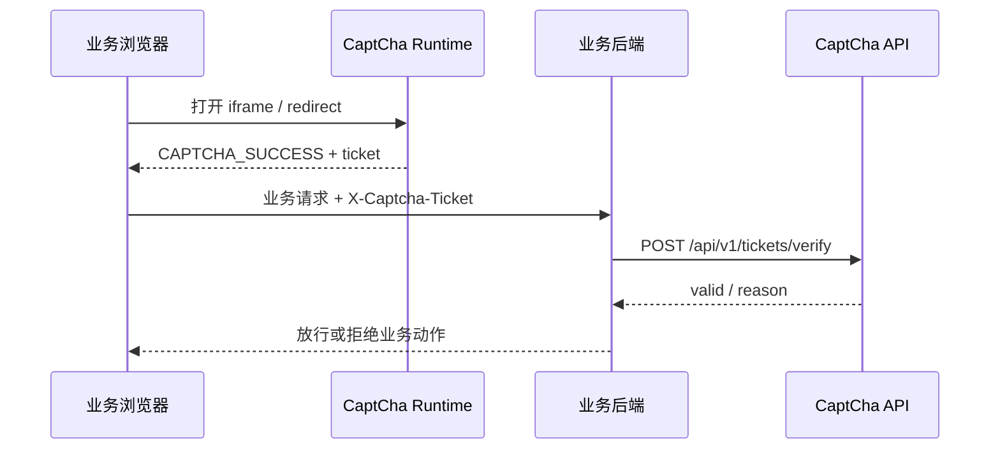

# 后端 ticket 核销

语言：中文 | [English](../en/backend-ticket-verification.md)

适合页面和业务后端都能改的场景。浏览器只拿一次性 `ticket`，业务后端在执行登录、注册、支付等动作前消费它。

## 请求链路



## 前端传 ticket

```html
<iframe
  src="https://captcha.example.com/?client_id=demo&scene=login&captcha_type=AUTO&route=/api/login&request_nonce=nonce-123"
  width="360"
  height="420"
  title="CaptCha"
></iframe>

<script>
  window.addEventListener("message", (event) => {
    if (event.origin !== "https://captcha.example.com") return;
    if (event.data?.type !== "CAPTCHA_SUCCESS") return;

    fetch("/api/login", {
      method: "POST",
      headers: {
        "content-type": "application/json",
        "x-captcha-ticket": event.data.ticket,
        "x-captcha-request-nonce": "nonce-123"
      },
      body: JSON.stringify({ username: "alice", password: "secret" })
    });
  });
</script>
```

## 后端消费 ticket

`client_secret` 只放在后端。`consume: true` 表示 ticket 用完即失效，重复提交应失败。

```ts
app.post("/api/login", async (req, res) => {
  const result = await fetch("https://captcha.example.com/api/v1/tickets/verify", {
    method: "POST",
    headers: {
      "content-type": "application/json",
      "x-captcha-client-secret": process.env.CAPTCHA_CLIENT_SECRET || ""
    },
    body: JSON.stringify({
      client_id: "demo",
      scene: "login",
      ticket: req.get("x-captcha-ticket") || "",
      route: "/api/login",
      request_nonce: req.get("x-captcha-request-nonce") || "",
      consume: true
    })
  }).then((response) => response.json());

  if (!result.valid) {
    return res.status(403).json({ error: result.reason || "CAPTCHA_FAILED" });
  }

  return res.json({ ok: true });
});
```

## 绑定上下文

- `route` 和 `request_nonce` 用来把 ticket 绑定到一次业务动作。
- 没有用户 `uid` 时，不需要伪造账号标识。
- 有账号或匿名设备标识时，由业务后端传 `account_id_hash` / `device_id_hash`，不要传原始 uid。
- 如果 ticket 是由中间件、Gateway 或策略接口创建的，消费时还要匹配当时绑定的 IP/User-Agent hash 和可选账号/设备 hash。

## Clearance

最小 iframe 接入可以只消费 ticket，不必处理 clearance。

如果你希望后续请求少弹验证码，建议优先用中间件或 Gateway。它们会自动处理 `captcha_clearance`、IP/UA 绑定、策略评估和失败上报。

## 继续阅读

- [快速接入](quickstart.md)
- [中间件接入](middleware-integration.md)
- [HTTP / gRPC API](api-reference.md)
